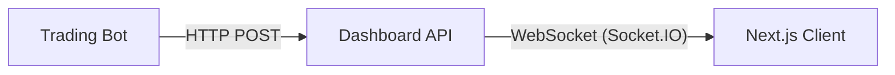

# Pulse Dashboard & Frontend Documentation

## Overview
This document outlines the architecture for the Pulse Dashboard, specifically the "My Trades" visualization. The goal is to provide real-time visualization of the trading bot's activity (active trades, P&L, history) in the web frontend.

## System Architecture

The system uses a **Push-Based Architecture**. The bot pushes its internal state to the Dashboard Server, which then broadcasts it to connected clients.



### Components

#### 1. Trading Bot (`Bot`)
-   **Source**: `src/pulse/trading/Bots/`
-   **Component**: `DashboardConnector` (`src/pulse/trading/dashboard_connector.py`)
-   **Responsibility**:
    -   Collects internal state (Active Trades, Win Rate, Balance, History).
    -   Formats data into a `BotState` JSON payload.
    -   Sends this payload to the API every 1 second via a background `asyncio` task.
    -   **Resilience**: Silently fails if the Dashboard API is offline, ensuring trading is never interrupted.

#### 2. Dashboard API (`API`)
-   **Server**: `src/pulse_dashboard/server/api.py`
-   **Responsibility**:
    -   Exposes endpoint `POST /api/bot/state`.
    -   Validates incoming data against the `BotState` Pydantic model.
    -   Emits `bot_state_update` events to all connected WebSocket clients.
    -   Acts as a relay/bridge; does not store persistent history (history comes from the bot's memory).

#### 3. Frontend (`Frontend`)
-   **Framework**: Next.js (App Router) + Tailwind CSS
-   **Source**: `src/pulse_dashboard/ui/app/trades/page.tsx`
-   **Components**:
    -   `TradeCard.tsx`: Visualizes individual active trades with real-time PnL (Green/Red styling).
    -   `TokenCard.tsx`: Detailed view of token metrics (Holders, Volume, Safety Scores).
    -   `StatCard.tsx`: Display for global stats (Balance, Win Rate).
-   **Responsibility**:
    -   Listens for `bot_state_update` events via `socket.io-client`.
    -   Renders the live state of the bot.

## Data Models

### BotState
The core data structure pushed from Bot to Frontend:

```python
class BotState(BaseModel):
    stats: BotStats          # Global counters (wins, losses, balance)
    active_trades: List[TradeInfo]  # Currently open positions
    recent_trades: List[Dict]       # Last N closed trades
```
