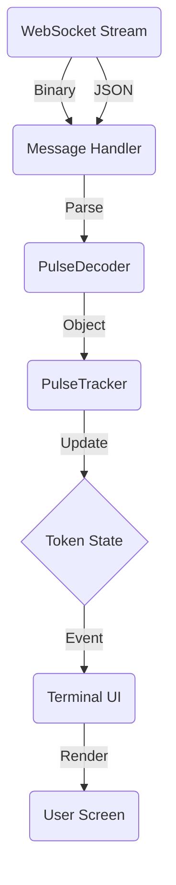

# Pulse Tracker System Documentation

## 1. System Overview

The **Pulse Tracker** is a real-time monitoring system designed to consume, decode, and visualize the high-frequency "Pulse" data feed from Axiom Trade. It bypasses standard polling mechanisms in favor of a reactive, event-driven architecture using WebSockets and Binary MessagePack data.

### Core Philosophy
-   **Speed**: Uses binary data (MessagePack) for minimal overhead.
-   **State**: Maintains a local "mirror" of the server state (Snapshot + Deltas).
-   **Reactivity**: The UI updates immediately upon data changes via callbacks.

---

## 2. Architecture & Data Flow

### System Architecture (Data Flow)

**1. Input Layer (Network)**
> **WebSocket Stream**
> ├── Binary Feed (Updates/Snapshots) → `_message_handler`
> └── JSON Feed (New Token Events) → `_message_handler`

**2. Processing Layer**
> `_message_handler`
> ├── Routes Binary → `PulseDecoder.from_array()`
> └── Routes JSON → `PulseTracker.process_json_message()`

**3. State Layer (The "Brain")**
> `PulseTracker`
> ├── Stores `self.tokens` (The Source of Truth)
> ├── Manages `self.categories` (NewPairs vs FinalStretch)
> └── Triggers Callbacks (`on_update`, `on_new_token`, `on_token_removed`)

**4. Visualization Layer (The "Face")**
> `PulseTUI`
> ├── Listens to Callbacks
> └── Renders Live Table via `rich`



---

## 3. Core Components

### A. WebSocket Layer
**Files**: `axiomtradeapi/websocket/handler.py`, `subscription.py`

This layer manages the raw connection to `wss://pulse2.axiom.trade/ws`.
-   **Handler (`_message_handler`)**: The gatekeeper. It listens continuously and determines if a message is:
    1.  **Binary**: Passes to `pulse` callback (MessagePack data).
    2.  **JSON**: Checks for `newPairs` room and passes to `new_pairs` callback.
-   **Subscription (`subscribe_to_pulse`)**: Sends the initial `userState` payload to subscribe to specific "rooms" (e.g., `finalStretch`, `newPairs`).

### B. The Decoder (`src/pulse/decoder.py`)

The **Translator**. It converts confusing raw data into clean Python objects.

-   **`PulseToken` Class**: A detailed Dataclass representing a single token.
-   **`from_array(data)`**: Parses **Binary** messages.
    -   Maps index `[0]` to `pair_address`, `[18]` to `liquidity`, etc.
    -   Handles ~50 different fields.
-   **`from_dict(data)`**: Parses **JSON** messages.
    -   Used for the `newPairs` feed which sends standard JSON objects.
-   **`parse_snapshot(data)`**: Parses Type 0 (Snapshot) messages.
    -   Initial full state with all tokens across all categories.
-   **`parse_new_token(data)`**: Parses Type 2 (New Token) messages.
    -   Full token data when a token starts being monitored.
-   **`parse_update(data, current_tokens)`**: Parses Type 1 (Update) messages.
    -   Receives a Type 1 "Delta" update (e.g., "Field 26 changed to 500").
    -   Updates the *existing* token object in memory without creating a new one.
-   **`parse_remove(data)`**: Parses Type 3 (Remove Token) messages.
    -   Explicit notification when a token stops being monitored.

### C. The Tracker (`src/pulse/tracker.py`)

The **Brain**. It holds the state of the world.

-   **State Storage**:
    -   `self.tokens`: A Dictionary mapping `pair_address` -> `PulseToken`.
    -   `self.categories`: A Dictionary mapping names (`finalStretch`, `newPairs`) to Sets of addresses.
-   **Message Processing**:
    -   **`process_message`**: Handles Binary MessagePack data.
        -   **Type 0 (Snapshot)**: Bulk loads tokens, populates categories. Sent once on connect.
        -   **Type 1 (Update)**: Incremental field updates for existing tokens. Sent every few seconds.
        -   **Type 2 (New Token)**: Full data for newly monitored token. Sent when token meets filter criteria.
        -   **Type 3 (Remove)**: Explicit removal notification. Sent when token no longer meets criteria.
    -   **`process_json_message`**: Handles JSON (legacy).
        -   Adds new tokens from the `newPairs` feed (if subscribed).
-   **Events (Callbacks)**:
    -   `on_update`: Fired whenever a token's data changes (Type 1).
    -   `on_new_token`: Fired when a token is seen for the first time (Type 0 or Type 2).
    -   `on_token_removed`: Fired when a token is explicitly removed (Type 3).

### D. The TUI (`src/pulse/tui.py`)

The **Face**. A terminal application built with `rich`.

-   **Connection**: Initializes the WebSocket and registers Tracker callbacks.
-   **Rendering**:
    -   Uses `rich.live.Live` to update the screen 4 times per second.
    -   **Table**: Sorts tokens (default: newest first) and displays color-coded metrics.
    -   **Performance**: Only reads from the Tracker's state; does not perform network calls itself.

---

## 4. How to Use & Extend

### Running the TUI
```bash
python src/pulse/tui.py
```

### Adding New Fields
1.  **Identify**: Find the field ID in the raw binary stream (using `test_pulse_decoder.py` debug logs).
2.  **Map**: Update `PulseDecoder.from_array` and `parse_update` to map that ID to a `PulseToken` attribute.
3.  **Visualize**: Add a column to `PulseTUI.generate_table`.

### Adding New Categories
1.  **Subscribe**: Update filters in `src/config/pulse_filters.py`.
2.  **Track**: `PulseTracker` automatically tracks them, but you may want to add specific category logic in `_handle_snapshot`.
